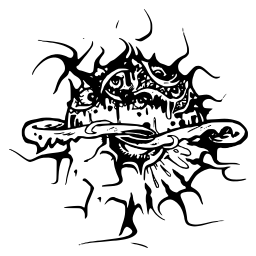
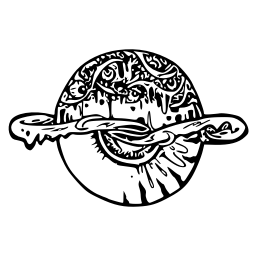

## 奇忽局艺术作品集

### @周宇 作品

[原稿](../assets/img/artefact/qihuju.jpeg) | [PNG大图](../assets/img/artefact/logo-no-text.png) | [SVG矢量图](../assets/img/artefact/logo-no-text.svg) | [CDR矢量](../assets/img/artefact/qihuju.cdr)

### @黄嘉欣 Chlor Huang 作品

#### 修格奇斯

[原稿](../assets/img/artefact/logo-art-1.jpeg) | [PNG大图](../assets/img/artefact/logo-art-1.png) | [SVG矢量图](../assets/img/artefact/logo-art-1.svg)

[原稿](../assets/img/artefact/logo-art-2.jpeg) | [PNG大图](../assets/img/artefact/logo-art-2.png) | [SVG矢量图](../assets/img/artefact/logo-art-2.svg)

@Tz 的同人配文

> **奉献**
>
>……我不知道祂从而何来，也不知道为何在我面前现身，当祂紧闭的瞳孔前纠缠在一起的触手开始蠕动，我的脑海中有一声非人的低语响起：“奉献……”我的内心突然充满了欣快感，仿佛沐浴在神启之下，又仿佛被天使的翅羽轻轻抚摸着脸颊，眼前的一切也被多彩的光晕包围。祂的瞳孔仍然没有张开，身体周边却沸腾起来，鼓涌出一道道的藤蔓，那藤蔓如火焰般向四周探索、伸展，渐渐向我靠近。“奉献……”我聆听着，哭泣着张开双臂，去拥抱这份恩赐，去拥抱这份来自上天的恩典。七彩的藤蔓将我包围，我被巨大的喜悦和快感灌注全身，这一刻，我的灵与肉便是祂的索取，我即是祂，祂即是我……当我再度清醒时，祂已经消失了，但我知道，祂与我同在。“奉献……”我喃喃自语，举起双手，我的手指沸腾起来，那鼓涌出的一道道藤蔓，仿佛火焰般向四周探索、伸展。奉献……

本网站内容遵从 **知识共享 CC-BY-SA-4.0** 协议。 [查阅详情](https://github.com/qihuju/qihuju.github.io/blob/main/LICENSE)